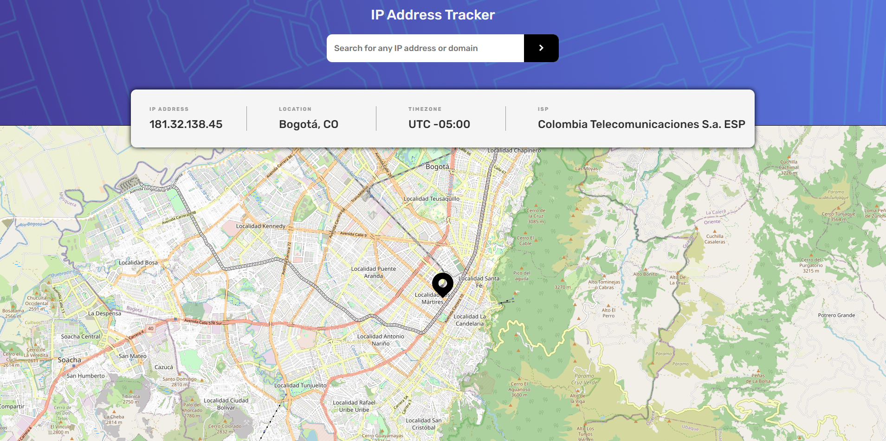

# Frontend Mentor - IP address tracker solution

Esta es mi propuesta de solucion al reto [IP address tracker challenge on Frontend Mentor](https://www.frontendmentor.io/challenges/ip-address-tracker-I8-0yYAH0).

## Tabla de contenidos

- [Descripcion](#descripcion)
  - [El desafio](#el-desafio)
  - [Screenshot](#screenshot)
  - [Links](#links)
- [Mi proceso](#mi-proceso)
  - [Hecho con](#hecho-con)
  - [Lo aprendido](#lo-que-aprendi)
  - [En desarrollo](#en-desarrollo)
- [Autor](#autor)


## Descripcion

Web para geo localizar una direccion IP o dominio y brindar informacion basica sobre la misma [IP Geolocation API by IPify](https://geo.ipify.org/) y [LeafletJS](https://leafletjs.com/).

## El desafio

El usuario deberia poder

- Ver el layout optimo dependiendo de su tamano de pantalla.
- Ver la interaccion cuando se coloca el mouse encima de los elementos.
- Ver su propia IP y geo localizacion al cargar la pagina por primera vez
- Buscar cualquier IP o dominio y brindar la informacion basica

## Screenshot



## Links

- Solucion: [GITHUB](https://github.com/J-HernandezM/ip-address-tracker)
- Live site: [PAGES](https://j-hernandezm.github.io/ip-address-tracker/)

## Mi proceso

Me alegra bastante haber podido lograr hacer este reto, siento que implemente la logica de la mejor manera posible, consultando lo minimo posible fuentes externas, solamente para una guia de como hacer x cosa.

Gracias al reto anterior que realice no se me complico como tal la request y manejo de la response de la API, sino mas que todo que los visuales se acomodaran bien a ella.

Tambien tuve que establecer ciertas logicas para diferenciar si se le dio click al icono dentro del boton o al boton como tal. Verificar si el input esta vacio o si se usa la tecla enter para pasar la informacion.

La parte que depronto se me dificulto mas fue la implementacion de la segunda API, pues esta tenia una documentacion ligeramente mas densa y compleja que las demas que he utilizado hasta ahora, pero logre solucionar con facilidad los problemas presentados

## Hecho con

- Semantic HTML5 markup
- CSS custom properties
- Flexbox
- CSS Grid
- Mobile-first workflow
- simple JavaScript
- API fetch

## Lo que aprendi

El uso de API's bastante interesante, la que mas me quedo llamando la atencion fue LeafletJS para la implementacion de mapas en proximos aplicativos.

Evitar que un form haga submit usando 
```html
    <form onsubmit="return false">
```

## En desarrollo

Me gustaria que el puntero de la ubicacion se quedara quieto en funcion del centro del mapa que inicialmente se marco. Tal vez en una feature futura lo agregue

## Autor

- Website - [Portfolio en construccion](https://j-hernandezm.github.io)
- Frontend Mentor - [@J-HernandezM](https://www.frontendmentor.io/profile/J-HernandezM)
- Github - [@J-HernandezM](https://github.com/J-HernandezM)
- Twitter - [@__HernandezM](https://www.twitter.com/__HernandezM)